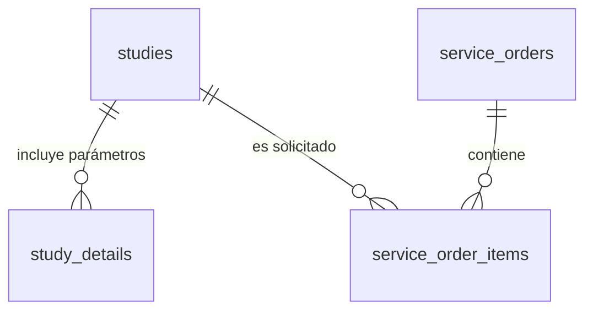

# Diccionario de la base analítica anonimizada

El respaldo contiene solo las cuatro tablas necesarias para reconstruir los datasets. No contiene tablas de pacientes, médicos, usuarios, notas ni datos de contacto. Los folios operativos no sintéticos se sustituyen por claves `ECO-REAL-*`.

## `operativo.studies`

Una fila representa un estudio del catálogo.

| Campo | Tipo | Llave/uso |
|---|---|---|
| `id` | integer | PK; trazabilidad, no variable del modelo. |
| `code` | text | Único; presentación y auditoría del lote. |
| `name` | text | Presentación, no variable del modelo. |
| `type` | text | Filtro/auditoría; regresión y clustering usan solo `study`. |
| `status` | text | Filtro de registros activos. |
| `isActive` | boolean | Filtro operativo. |
| `normalPrice` | numeric(12,2) | Y de regresión y X `price` de clustering. |
| `durationMinutes` | integer | Se transforma a X `delivery_hours`. |
| `method` | text | X categórica `analysis_method`. |
| `sampleType` | text | X categórica `sample_type`. |
| `requiresSpecialProcessing` | boolean | X binaria de clustering. |
| `indicator` | text | Control/auditoría del catálogo. |
| `isSynthetic` | boolean | Auditoría; nunca se usa como X. |

## `operativo.study_details`

Una fila representa un elemento o parámetro perteneciente a un estudio.

| Campo | Tipo | Llave/uso |
|---|---|---|
| `id` | integer | PK. |
| `study_id` | integer | FK → `studies.id`. |
| `dataType` | text | Permite contar solo filas `parameter`. |
| `isActive` | boolean | Excluye detalles inactivos. |

El agregado `COUNT(*) GROUP BY study_id` produce `parameter_count` para regresión y clustering.

## `operativo.service_orders`

Una fila representa una orden de servicio sin identidad del paciente ni del médico.

| Campo | Tipo | Llave/uso |
|---|---|---|
| `id` | integer | PK; trazabilidad, nunca X. |
| `folio` | text | Único y seudonimizado; auditoría de origen. |
| `branchName` | text | X categórica de clasificación. |
| `sampleAt` | timestamp | Calcula tiempo prometido. |
| `deliveryAt` | timestamp | Calcula tiempo prometido y Y histórica. |
| `completedAt` | timestamp | Solo construye Y; se excluye de X para evitar fuga. |
| `status` | text | Solo construye Y/filtros históricos. |
| `subtotalAmount` | numeric(12,2) | X numérica de clasificación. |
| `courtesyPercent` | numeric(6,2) | X numérica de clasificación. |
| `discountAmount` | numeric(12,2) | X numérica de clasificación. |
| `totalAmount` | numeric(12,2) | X numérica de clasificación. |
| `isActive` | boolean | Filtro operativo. |
| `createdAt` | timestamp | Corte temporal y variables hora/día. |
| `updatedAt` | timestamp | Marca de agua/auditoría, nunca X. |
| `isSynthetic` | boolean | Auditoría; nunca X. |

## `operativo.service_order_items`

Una fila representa un estudio incluido en una orden.

| Campo | Tipo | Llave/uso |
|---|---|---|
| `id` | integer | PK. |
| `service_order_id` | integer | FK → `service_orders.id`. |
| `study_id` | integer | FK lógica → `studies.id`. |
| `priceType` | text | X categórica dominante de clasificación. |
| `unitPrice` | numeric(12,2) | Importe del renglón. |
| `quantity` | integer | Agregados de cantidad y demanda. |
| `discountPercent` | numeric(6,2) | Descuento del renglón. |
| `subtotalAmount` | numeric(12,2) | Importe del renglón. |
| `source_package_id` | integer/null | Permite contar componentes procedentes de paquete. |

## Datos derivados y privacidad

- Regresión une `studies` con el conteo de `study_details`.
- Clustering agrega los ítems por estudio dentro de un corte temporal.
- Clasificación agrega los ítems por orden y deriva Y con estado/fechas finales.
- Ningún dataset incluye nombre o identificador de paciente, médico o usuario.
- `id`, código, nombre, folio, fechas de actualización y marcas sintéticas son campos de auditoría, no predictores.
